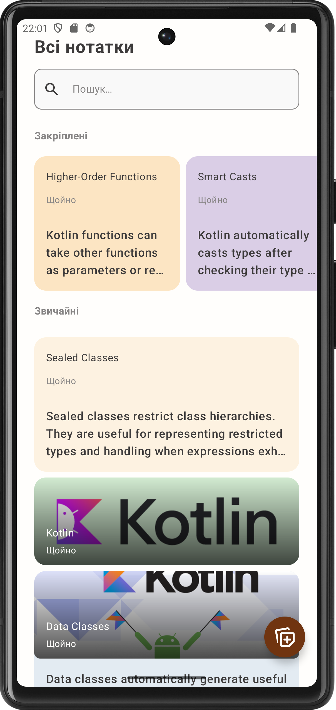
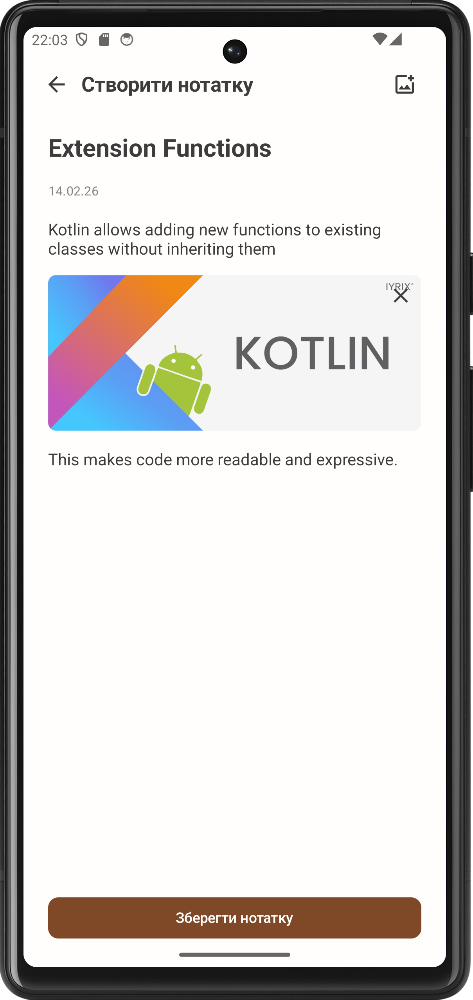
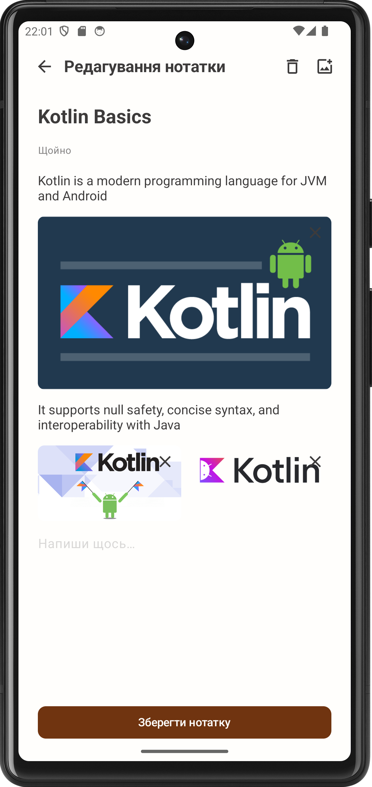

# Notes

A modern Android note-taking application built with Jetpack Compose and Clean Architecture.


## Features

- **Create & Edit Notes** - Rich content with text and images
- **Image Support** - Add photos from gallery with automatic internal storage management
- **Pin Notes** - Keep important notes at the top (long press to pin/unpin)
- **Search** - Real-time search through note titles and content
- **Smart Date Formatting** - Relative timestamps ("just now", "2 hours ago")
- **Modern UI** - Material Design 3 with custom brown color palette
- **Offline First** - All data stored locally with Room database
- **Localization** - English and Ukrainian language support

## Screenshots

<!-- Add screenshots to the screenshots/ folder -->
| Notes List | Create Note | Edit Note |
|:----------:|:-----------:|:---------:|
|  |  |  |

## Tech Stack

| Technology | Version | Purpose |
|------------|---------|---------|
| **Kotlin** | 2.3.0 | Programming Language |
| **Jetpack Compose** | BOM 2026.01.01 | Modern UI Toolkit |
| **Material 3** | Latest | Design System |
| **Room** | 2.8.4 | Local Database |
| **Hilt** | 2.57.1 | Dependency Injection |
| **Navigation 3** | 1.0.0 | Type-safe Navigation |
| **Coil** | 3.3.0 | Image Loading |
| **Kotlin Serialization** | 1.10.0 | Data Serialization |
| **Core Splash Screen** | 1.2.0 | Splash Screen API |

## Architecture

The app follows **Clean Architecture** principles with clear separation of concerns:

```
com.example.notes/
├── MyApp.kt                    # Hilt-enabled Application class
│
├── presentation/               # UI Layer
│   ├── MainActivity.kt         # Entry point with Splash Screen
│   ├── screens/
│   │   ├── notes/              # Notes list screen
│   │   │   ├── NotesScreen.kt
│   │   │   └── NotesViewModel.kt
│   │   ├── creation/           # Create note screen
│   │   │   ├── CreateNoteScreen.kt
│   │   │   └── CreateNoteViewModel.kt
│   │   └── editing/            # Edit note screen
│   │       ├── EditNoteScreen.kt
│   │       └── EditNoteViewModel.kt
│   ├── components/             # Reusable UI components
│   │   ├── Content.kt          # Mixed content renderer
│   │   ├── TextContent.kt      # Text input field
│   │   ├── ImageContent.kt     # Image with delete button
│   │   └── ImageGroup.kt       # Multiple images layout
│   ├── navigation/
│   │   └── NavGraph.kt         # Navigation 3 setup
│   ├── ui/theme/
│   │   ├── Theme.kt
│   │   ├── Color.kt
│   │   ├── Type.kt
│   │   └── CustomIcons.kt
│   └── utils/
│       └── DateFormatter.kt    # Relative date formatting
│
├── domain/                     # Business Logic Layer
│   ├── Note.kt                 # Core domain model
│   ├── ContentItem.kt          # Sealed interface (Text/Image)
│   ├── NotesRepository.kt      # Repository interface
│   └── usecases/
│       ├── AddNoteUseCase.kt
│       ├── EditNoteUseCase.kt
│       ├── DeleteNoteUseCase.kt
│       ├── GetNoteUseCase.kt
│       ├── GetAllNotesUseCase.kt
│       ├── SearchNotesUseCase.kt
│       └── SwitchPinnedStatusUseCase.kt
│
├── data/                       # Data Layer
│   ├── NotesDatabase.kt        # Room database (v3)
│   ├── NotesDao.kt             # Data access with transactions
│   ├── NotesRepositoryImpl.kt  # Repository implementation
│   ├── Mapper.kt               # Entity <-> Domain mapping
│   ├── ImageFileManager.kt     # Image storage management
│   ├── NoteDbModel.kt
│   ├── ContentItemDbModel.kt
│   └── NoteWithContentDbModel.kt
│
└── di/
    └── AppModule.kt            # Hilt module
```

## Design Patterns

- **MVVM** - ViewModel manages UI state with StateFlow
- **MVI** - Unidirectional data flow with Commands/Events
- **Repository Pattern** - Abstraction over data sources
- **Use Cases** - Single responsibility business logic
- **Dependency Injection** - Hilt for loose coupling
- **AssistedFactory** - Parameterized ViewModel injection

## Database Schema

Room Database v3 with cascade deletion:

```sql
-- Notes table
CREATE TABLE notes (
    id INTEGER PRIMARY KEY AUTOINCREMENT,
    title TEXT NOT NULL,
    updatedAt INTEGER NOT NULL,
    isPinned INTEGER NOT NULL
);

-- Content table (One-to-Many with composite key)
CREATE TABLE content (
    noteId INTEGER NOT NULL,
    order INTEGER NOT NULL,
    contentType TEXT NOT NULL,  -- TEXT or IMAGE
    content TEXT NOT NULL,
    PRIMARY KEY (noteId, order),
    FOREIGN KEY (noteId) REFERENCES notes(id) ON DELETE CASCADE
);
```

## Getting Started

### Prerequisites

- Android Studio Ladybug (2024.2.1) or newer
- JDK 17
- Android SDK 35

### Installation

1. Clone the repository
```bash
git clone https://github.com/yourusername/notes.git
```

2. Open in Android Studio

3. Sync Gradle files

4. Run on emulator or device (API 24+)

### Build

```bash
# Debug build
./gradlew assembleDebug

# Release build
./gradlew assembleRelease

# Run tests
./gradlew test
```

## Project Configuration

| Property | Value |
|----------|-------|
| Min SDK | 24 (Android 7.0) |
| Target SDK | 35 (Android 15) |
| Compile SDK | 35 |
| Java Version | 11 |
| Kotlin Version | 2.3.0 |

## State Management

The app uses **StateFlow** for state and **Channel** for one-time events:

```kotlin
class NotesViewModel : ViewModel() {
    private val _state = MutableStateFlow(NotesState())
    val state: StateFlow<NotesState> = _state.asStateFlow()

    private val _event = Channel<NotesEvent>()
    val event = _event.receiveAsFlow()

    fun processCommand(command: NotesCommand) {
        when (command) {
            is NotesCommand.Search -> searchNotes(command.query)
            // ...
        }
    }
}

@Composable
fun NotesScreen(viewModel: NotesViewModel = hiltViewModel()) {
    val state by viewModel.state.collectAsStateWithLifecycle()
    // ...
}
```

## Navigation

Using **Jetpack Navigation 3** with type-safe routes:

```kotlin
@Serializable
sealed interface Screen : NavKey {
    @Serializable
    data object Notes : Screen

    @Serializable
    data object CreateNote : Screen

    @Serializable
    data class EditNote(val noteId: Int) : Screen
}
```

## Localization

The app supports multiple languages:
- English (default)
- Ukrainian (uk)

Includes proper plural forms for relative date formatting.

## Testing

Testing libraries configured:

| Library | Version | Purpose |
|---------|---------|---------|
| JUnit | 4.13.2 | Unit testing |
| MockK | 1.14.9 | Kotlin mocking |
| Turbine | 1.2.0 | Flow testing |
| Truth | 1.4.4 | Assertions |

## Acknowledgments

- [Jetpack Compose](https://developer.android.com/jetpack/compose)
- [Material Design 3](https://m3.material.io/)
- [Coil](https://coil-kt.github.io/coil/)
- [Room](https://developer.android.com/training/data-storage/room)
- [Hilt](https://dagger.dev/hilt/)

---

Made with ❤️ using Jetpack Compose